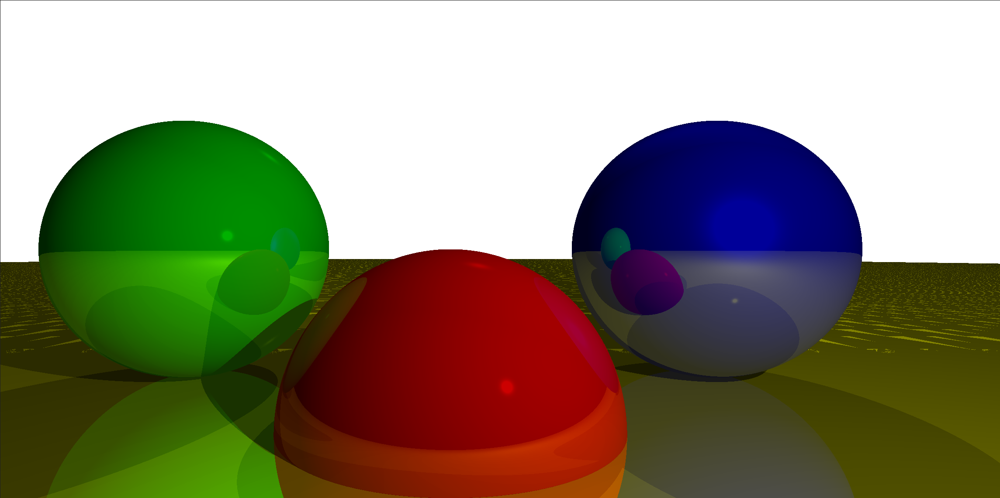

## BeLight
Experiments on graphic programming.

The actual goal is to make a minimal 3D software renderer for learning purposes.

## Dependencies

This project requires SDL2 for windowing and framebuffer. Install following packages:

SDL2:

```sudo apt install libsdl2-dev```

## Ray Tracing Scene



## Build
```
cmake -B build && \
cmake --build build && \
./build/bin/BeLight
```
or

`./build.sh
`
